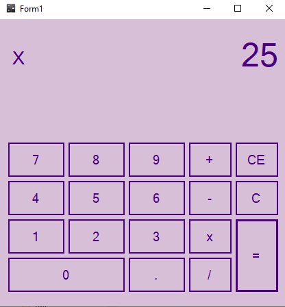

# Calculadora Simples feita com CSharp

Calculadora simples feita com C#.   
Nesse projeto construi uma calculadora simples,   
com as principais operações aritméticas, adição,  
subtração, multiplicação e divisão.


## O que foi utlizado

- Windows forms.
- Variavel decimal.
- Condição : if, else if e else.
- Conversão de numero para string.

## Execultavel do programa

```bash
  CalculadoraSimples-CSharp/Calculadora com Interface/Calculadora com Interface/bin/Debug
```




